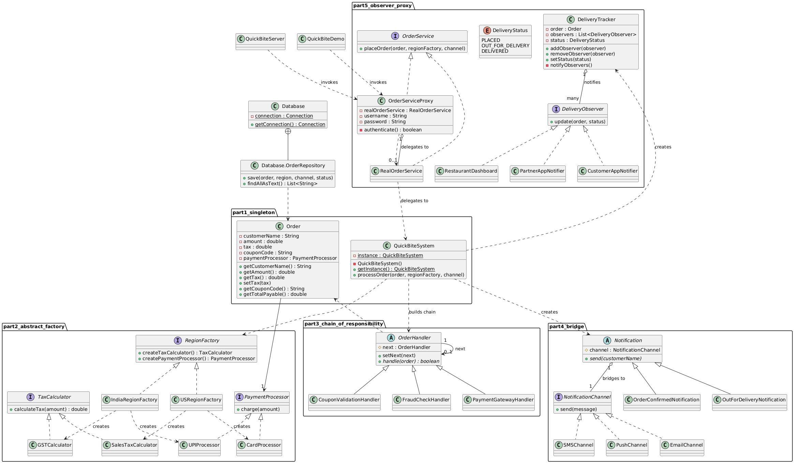
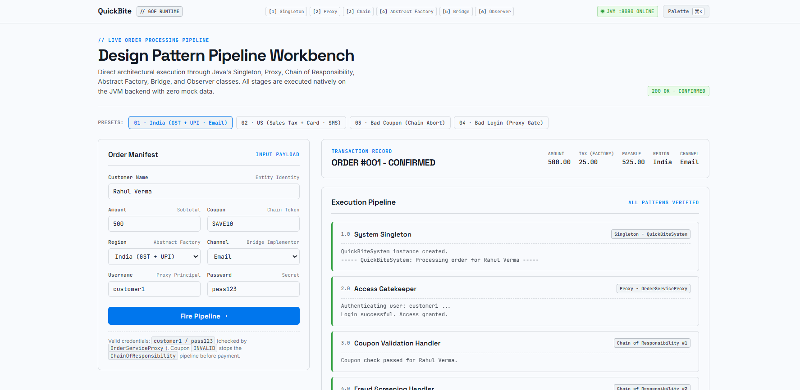
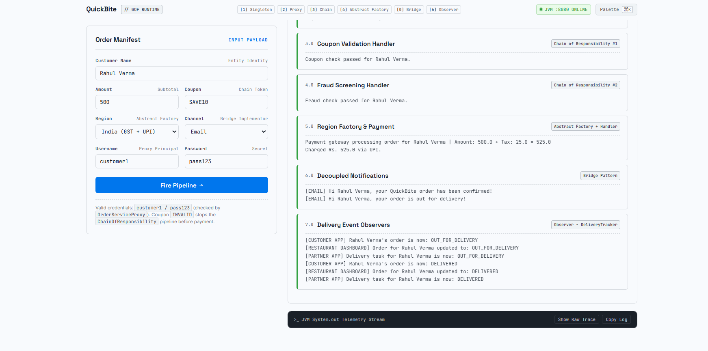

# 🍔 QuickBite

*A little food-delivery order pipeline that turns six textbook Gang-of-Four patterns into one real, clickable, running system.*

## 🎯 About

QuickBite is an order-processing pipeline for a fictional food-delivery app - but instead of just *talking about* Singleton, Proxy, Chain of Responsibility, Abstract Factory, Bridge and Observer, it actually **runs** them, live, from a browser. You fill in an order form, hit **Fire Pipeline**, and watch every single pattern do its job in real time against a real JVM backend, with the trace of what each class did printed straight from `System.out`.

> [!NOTE]
> Every stage you see on screen - the login check, the tax math, the payment call, the notifications - is a real Java object doing real work. Nothing on this dashboard is faked or hardcoded for show.

It's built for anyone who's tired of pattern diagrams that never actually *do* anything.

## 🔄 How It Works

1. 🖥️ **Open the workbench** - you land on a clean dashboard called the *Design Pattern Pipeline Workbench*, with an order form on the left and a live execution trace on the right.
2. 📝 **Fill the Order Manifest** - customer name, amount, a coupon code, a region (India or US), a notification channel, and login credentials.
3. ⚡ **Hit Fire Pipeline** - the form posts straight to the Java backend, no mock responses, no fake delays.
4. 🔐 **The Proxy checks you in** - your username and password are verified before anything else even runs.
5. 🎟️ **The Chain of Responsibility takes over** - coupon validation, then fraud screening, then the payment gateway, each handler passing the order to the next only if it's happy.
6. 🌍 **The Abstract Factory picks your region's rules** - GST + UPI for India, Sales Tax + Card for the US, generated on the fly.
7. 📣 **The Bridge fires your notification** - the same "Order Confirmed" message, rendered for whichever channel you picked (Email, SMS, or Push).
8. 👀 **The Observers watch delivery status** - as the order moves to *Out for Delivery* and *Delivered*, three independent listeners (Customer App, Restaurant Dashboard, Partner App) all react on their own.
9. ✅ **You get a full transaction record** - amount, tax, payable total, region and channel, plus the entire step-by-step trace underneath it.

## ✨ Features

### 🧩 Core Pattern Engine
- 🔥 **Singleton System Core** - `QuickBiteSystem` guarantees exactly one instance manages every order, proven live by an identity check at startup.
- 🔥 **Proxy Access Gate** - `OrderServiceProxy` sits in front of the real order service and blocks any request with bad credentials before it ever touches business logic.
- 🔥 **Chain of Responsibility Pipeline** - coupon validation → fraud check → payment gateway, each as its own handler, each able to stop the chain dead.
- 🔥 **Abstract Factory Regions** - swap the entire tax + payment strategy (GST/UPI vs Sales Tax/Card) just by picking a region from a dropdown.
- 🔥 **Bridge Notifications** - notification *type* (Order Confirmed, Out for Delivery) is fully decoupled from *channel* (Email, SMS, Push), so any message can go out any way.
- 🔥 **Observer Delivery Tracking** - one status update broadcasts to three completely independent listeners at once.

> [!TIP]
> The coolest part isn't any one pattern - it's that all six are **wired into a single real pipeline**. A bad coupon doesn't just print an error, it actually halts execution before the payment handler ever runs.

### 🖱️ UI & Experience
- 🔥 **Live Preset Scenarios** - one-click presets for a clean India order, a US order, a rejected coupon, and a rejected login, so you can see both the happy path and the failure paths instantly.
- 🔥 **Step-by-Step Execution Trace** - every pattern's output is rendered as its own labelled card (Singleton, Proxy, Chain of Responsibility #1/#2, Abstract Factory + Handler, Bridge, Observer).
- 🔥 **Raw JVM Telemetry Stream** - a terminal-style console at the bottom shows the actual `System.out` log, with a one-click **Copy Log** button.
- 🔥 **Live JVM Status Badge** - a green "JVM :8080 ONLINE" pill confirms the backend is actually up and answering requests.

> [!TIP]
> Try the "Bad Coupon" and "Bad Login" presets first - watching the pipeline stop itself mid-flow is honestly more satisfying than watching it succeed.

### 💾 Persistence
- 🔥 **SQLite Order History** - every processed order gets saved to a local `orders.db` file via a hand-rolled DAO layer, so you can query order history after the fact.
- 🔥 **Zero-Framework HTTP Server** - the whole backend runs on Java's built-in `com.sun.net.httpserver`, serving both the frontend and the `/api/order` endpoint with no external web framework at all.

## 📐 UML Class Diagram

  

Complete UML class diagram illustrating how all 6 GoF design patterns (Singleton, Proxy, Chain of Responsibility, Abstract Factory, Bridge, and Observer) connect and interact across the QuickBite pipeline.

## 🎭 Use Cases

| 👤 Who | 🎯 What they do with it |
|--------|--------------------------|
| 🎓 CS students learning OOP | Finally *see* what Singleton, Proxy, or Observer actually look like at runtime instead of just reading UML |
| 🏆 Hackathon teams | Reuse the pattern-pipeline structure as a template for their own multi-stage processing systems |
| 👩‍🏫 Instructors | Demo all six GoF patterns working together in one live walkthrough instead of six disconnected code snippets |
| 🧑‍💻 Interview prep | Point to a real, running project the next time "explain the Proxy pattern" comes up |
| 🛠️ Hobbyist backend tinkerers | Study a from-scratch Java HTTP server with zero frameworks, start to finish |
| 📚 Portfolio builders | Pin a project that shows architecture thinking, not just CRUD |

> [!IMPORTANT]
> For **CS students**, this project doubles as a live reference - every pattern you'd normally memorise from a textbook diagram has a matching, runnable class right here, reacting to real input.

## 🛠️ Built With

| Technology | What it does in THIS project |
|---|---|
|  | Powers every design-pattern class and the entire backend logic |
|  | Java's built-in HTTP server - serves the frontend and the `/api/order` endpoint with zero external frameworks |
|  | Persists every processed order to `orders.db` via JDBC |
|  | Renders the Design Pattern Pipeline Workbench dashboard |
|  | Fires the pipeline requests and paints the live execution trace |
|  | Project structure, module, and dependency management |

No frameworks, no build tool, no ORM - just raw Java doing the heavy lifting, which honestly makes the pattern work easier to actually read.

## 📸 Screenshots

  
    
  

Left: the Design Pattern Pipeline Workbench with presets and a confirmed order. Right: the full execution trace, from Coupon Validation through Delivery Observers.

## 🤓 Did You Know?

> [!NOTE]
> QuickBite's backend has **no external web framework at all** - the entire server is built on Java's own `com.sun.net.httpserver`.

> [!NOTE]
> A single delivery status update fires **three separate Observers** at once - Customer App, Restaurant Dashboard, and Partner App - each finding out independently.

> [!NOTE]
> An invalid coupon never even reaches the payment gateway - the Chain of Responsibility halts the entire pipeline one step early.

- 💬 The SQLite driver is force-loaded manually with `Class.forName("org.sqlite.JDBC")` before any connection is opened.
- 💬 The India and US regions don't just change a number - they swap in a completely different tax calculator *and* a completely different payment processor via the Abstract Factory.

*Built for the Design Pattern Lab* 🧪

Made with ❤️ by [yash5123](https://github.com/yash5123)

